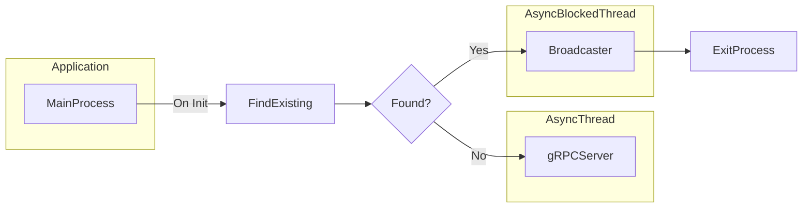
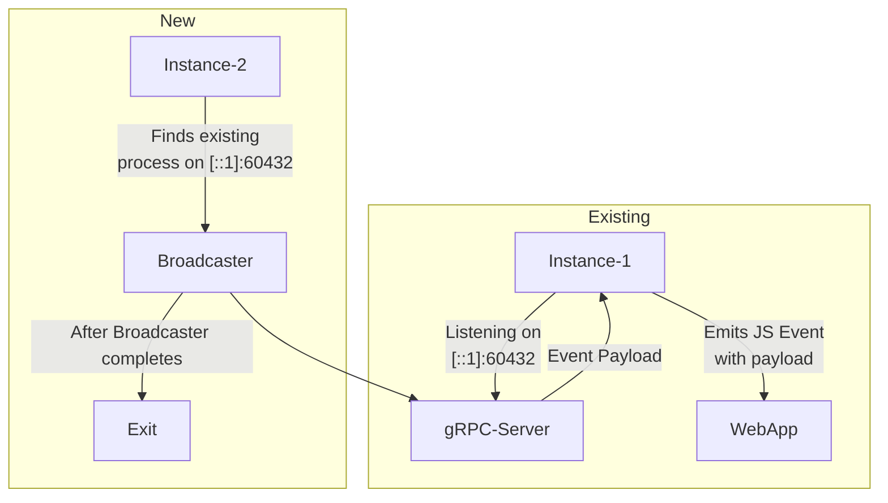

# Tauri Plugin Highlander

A Tauri Plugin to ensure there can only be 1 instance of a tauri application running and emits the second instances arguments to the Javascript via an event listener.


The plugin was named **Highlander** based on the [Film/Series Franchise](https://en.wikipedia.org/wiki/Highlander_(franchise)) where the immortals seek the "quickening" to make them stronger. The immortals hold to the motto "There can only be one".

# Architecture

The main process (your tauri app) upon initiation of the Highlander plugin will search for existing processes by the same name.

If no existing process is found then it will create a gRPC Server that will listen on and ipv6 loopback with a random port (defaults to `[::1]:0`).

If an existing process is found then it will search the existing listening sockets that is associated to that existing process ID then open a gRPC client to that instance (using the ip/port found in the socket list). This will trigger the existing instance to emit an event to the tauri-app passing in the opening arguments of the newest instance.

[](https://mermaid.live/edit#eyJjb2RlIjoiZ3JhcGggTFJcbiAgc3ViZ3JhcGggQXBwbGljYXRpb25cbiAgICBNYWluUHJvY2Vzc1xuICBlbmRcbiAgc3ViZ3JhcGggQXN5bmNUaHJlYWRcbiAgICBnUlBDU2VydmVyXG4gIGVuZFxuICBzdWJncmFwaCBBc3luY0Jsb2NrZWRUaHJlYWRcbiAgICBCcm9hZGNhc3RlclxuICBlbmRcblxuICBNYWluUHJvY2VzcyAtLT4gfE9uIEluaXR8IEZpbmRFeGlzdGluZyAtLT4gRXhpc3Rpbmd7Rm91bmQ_fVxuICBFeGlzdGluZyAtLT4gfFllc3wgQnJvYWRjYXN0ZXIgLS0-IEV4aXRQcm9jZXNzXG4gIEV4aXN0aW5nIC0tPiB8Tm98IGdSUENTZXJ2ZXIiLCJtZXJtYWlkIjoie1xuICBcInRoZW1lXCI6IFwiZGVmYXVsdFwiXG59IiwidXBkYXRlRWRpdG9yIjpmYWxzZSwiYXV0b1N5bmMiOnRydWUsInVwZGF0ZURpYWdyYW0iOmZhbHNlfQ)

This is an example connectivity between the Existing Instance and a New Instance being launched.

[](https://mermaid.live/edit#eyJjb2RlIjoiZ3JhcGggVERcbiAgc3ViZ3JhcGggRXhpc3RpbmdcbiAgICBJbnN0YW5jZS0xXG4gICAgZ1JQQy1TZXJ2ZXJcbiAgICBXZWJBcHBcbiAgZW5kXG4gIHN1YmdyYXBoIE5ld1xuICAgIEluc3RhbmNlLTJcbiAgICBCcm9hZGNhc3RlclxuICAgIEV4aXRcbiAgZW5kXG4gIEluc3RhbmNlLTEgLS0-IHxcIkxpc3RlbmluZyBvbiA8YnIgLz4gWzo6MV06NjA0MzJcIiB8IGdSUEMtU2VydmVyXG4gIEluc3RhbmNlLTEgLS0-IHxcIkVtaXRzIEpTIEV2ZW50PGJyLz53aXRoIHBheWxvYWRcInwgV2ViQXBwXG4gIGdSUEMtU2VydmVyIC0tPiB8XCJFdmVudCBQYXlsb2FkXCJ8IEluc3RhbmNlLTFcbiAgSW5zdGFuY2UtMiAtLT4gfFwiRmluZHMgZXhpc3RpbmcgPGJyIC8-cHJvY2VzcyBvbiBbOjoxXTo2MDQzMlwifCBCcm9hZGNhc3RlciAtLT4gZ1JQQy1TZXJ2ZXJcbiAgQnJvYWRjYXN0ZXIgLS0-IHxcIkFmdGVyIEJyb2FkY2FzdGVyIGNvbXBsZXRlc1wifCBFeGl0IiwibWVybWFpZCI6IntcbiAgXCJ0aGVtZVwiOiBcImRlZmF1bHRcIlxufSIsInVwZGF0ZUVkaXRvciI6dHJ1ZSwiYXV0b1N5bmMiOnRydWUsInVwZGF0ZURpYWdyYW0iOnRydWV9)

<details><summary>MermaidJS Diagrams</summary>
<p>
If the markdown renderer supports mermaid the following will show the same images as above, however if your renderer (Github...) doesn't understand mermaidJS code blocks then you will see the Text used to generate the diagrams above.



This is an example connectivity between the Existing Instance and a New Instance being launched.



</p>
</details>

# Getting Started

The Highlander Builder was created to make the intitiation of the plugin easier and to allow for features later without a major refactor. The builder has a `default()` method that will setup the following variables

| Variable | Description | Value |
| -- | -- | -- |
| event | The event name to broadcast to the WebApp | `quickening` |
| label | The label of the window to broadcast the event | `main` |
| listener | The `SocketAddress` to listen to for the gRPC Opener server | `[::1]:0` |

Each variable can be set after initializing with `default()` by method chaning.

```rust
HighlanderBuilder::default()
    .event("yourEventName".to_string())
```